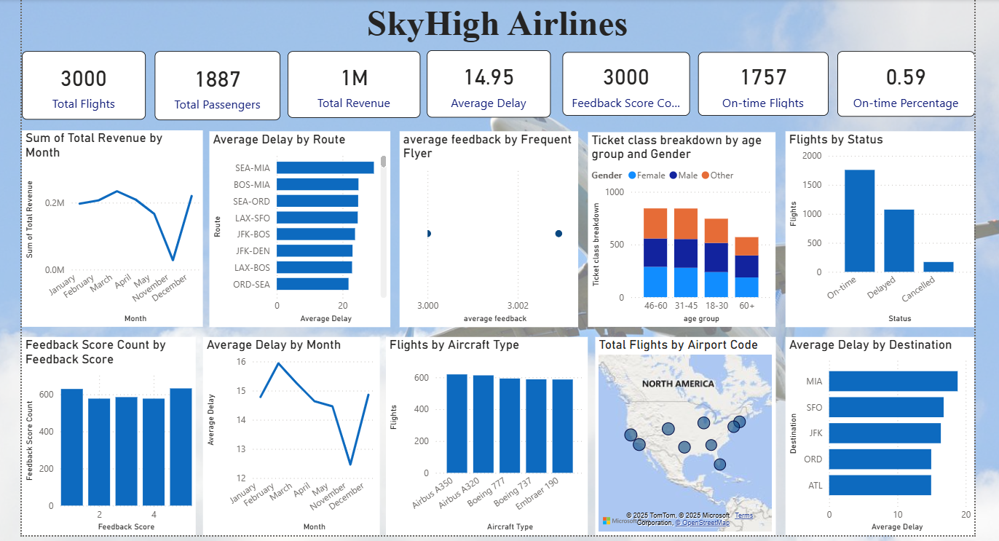

# ✈️ Airline Analytics Dashboard | Power BI

## 📊 Overview
An interactive Power BI dashboard analyzing airline data to track performance, trends, and key business metrics.  
Designed to support data-driven decision-making through clear and insightful visualizations.

---

## 🔍 Key Insights
- KPI-based performance analysis  
- Trend and comparison analysis  
- Interactive filters for deeper insights  

---

## 🛠 Tools Used
- Power BI  
- Data Cleaning & Transformation  
- Data Modeling  
- DAX (Basic Measures)  

---
## 🖼 Dashboard Preview

